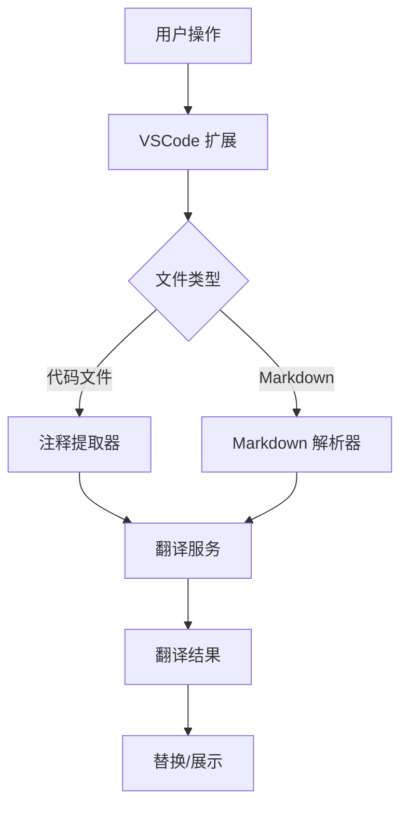

# VSCode 翻译扩展重构计划

## 项目概述

将现有 Vue 3 + Vite Web 应用转换为 VSCode 扩展，支持代码注释翻译和 Markdown 文件翻译。

## 架构设计



## 实现步骤

### 1. 修改 package.json

- 添加 `extension` 入口点配置
- 添加 `vscode` 依赖
- 配置扩展元数据（name, publisher, engines）

### 2. 创建扩展入口文件

- `src/extension.ts` - 扩展主入口
- 注册命令和事件监听器

### 3. 实现代码注释翻译

- 支持语言：JavaScript, TypeScript, Python, Java, C/C++, Go, Rust 等
- 识别注释类型：行注释、块注释、文档注释
- 替换逻辑：原地替换翻译结果

### 4. 实现 Markdown 翻译

- 解析 Markdown 结构
- 识别需要翻译的文本节点（标题、段落、列表项）
- 保留 Markdown 格式

### 5. 翻译服务集成

- 使用免费翻译 API（如 Google Translate 非官方 API 或其他免费方案）
- 支持多语言对
- 添加 API 密钥配置支持

### 6. 用户界面

- 命令面板集成
- 状态栏显示
- 翻译结果预览

## 关键技术点

| 功能 | 技术方案 |
|------|----------|
| 注释识别 | 正则表达式 + AST 解析器 |
| Markdown 解析 | markdown-it |
| 翻译 API | 免费 REST API |
| VSCode API | vscode-languageclient 或原生 API |

## 文件结构变更

```
.
├── src/
│   ├── extension.ts      # 扩展入口
│   ├── translator/       # 翻译模块
│   │   ├── index.ts
│   │   ├── comments.ts   # 注释翻译
│   │   └── markdown.ts   # Markdown 翻译
│   └── services/         # 翻译服务
│       └── translate.ts
├── package.json          # 更新配置
└── README.md             # 更新文档
```
